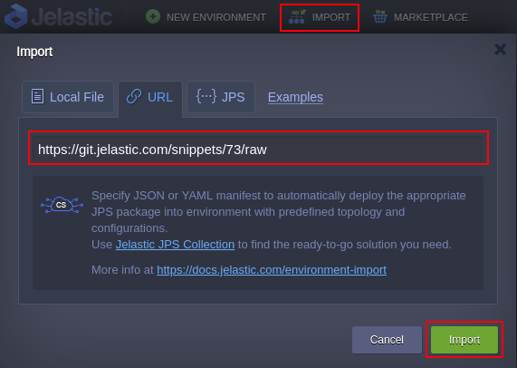
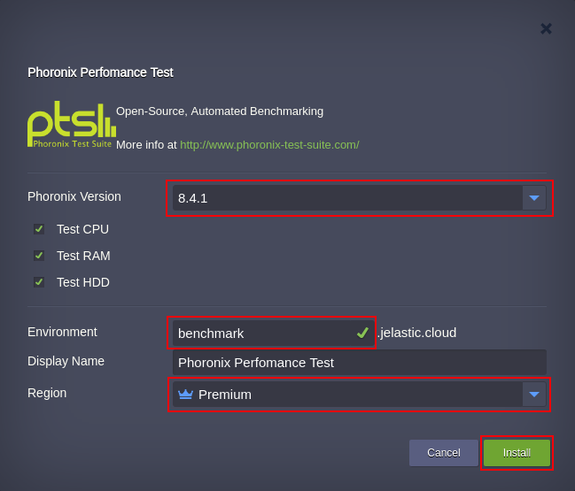
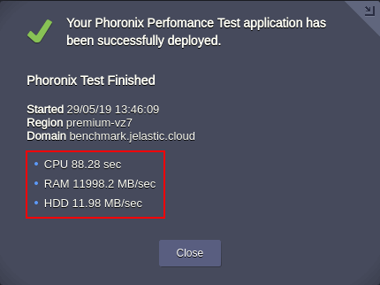

# Jelastic Platform Performance Benchmark

Phoronix Test Suite is an open source platform for conducting automated tests, as well as for reporting test results regarding the Platform performance.
  
  Import the required manifest using the link from GitHub: [https://github.com/jelastic-jps/phoronix/blob/master/manifest.jps](https://github.com/jelastic-jps/phoronix/blob/master/manifest.jps)
  

 

If required change the Phoronix software version, environment name, preferable region and press Install button to begin installation procedure and run the tests.

 

Once the tests are completed the successful installation window displays the test result.

 

[Lean more](https://jelastic.cloud/evaluation-criteria) how to find out the platform performance rate according to the test result.

